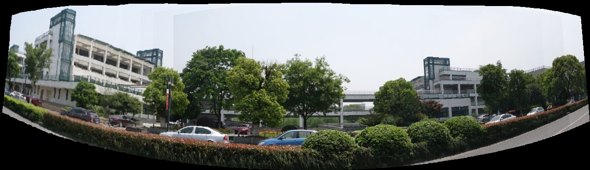
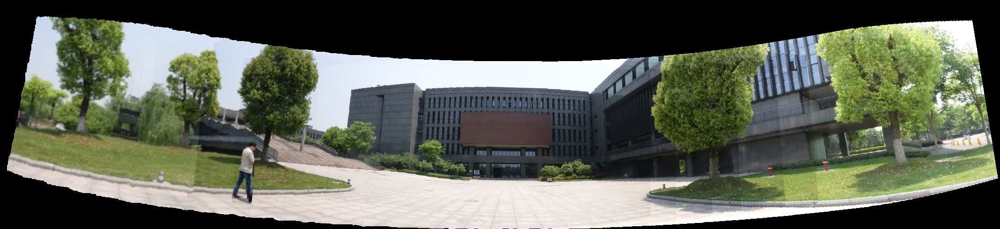

# panorama-stitching

This is a project of computer photography course, written in C++.

For any problem about this project, please contact: **dihuanginfo[at]gmail.com**

## Introduction

In this project, I use several steps to accomplish panorama-stitching algorithm.

* Cylindrical projection
* SIFT descriptor
* Correspondence
* Bilinear interpolation images stitching
* Linear smooth

You can read my code and know how I do upper operations.

## Requirement

* OpenCV 2

## Run

just  run main.cpp

## Result
example 1:

example 2:

